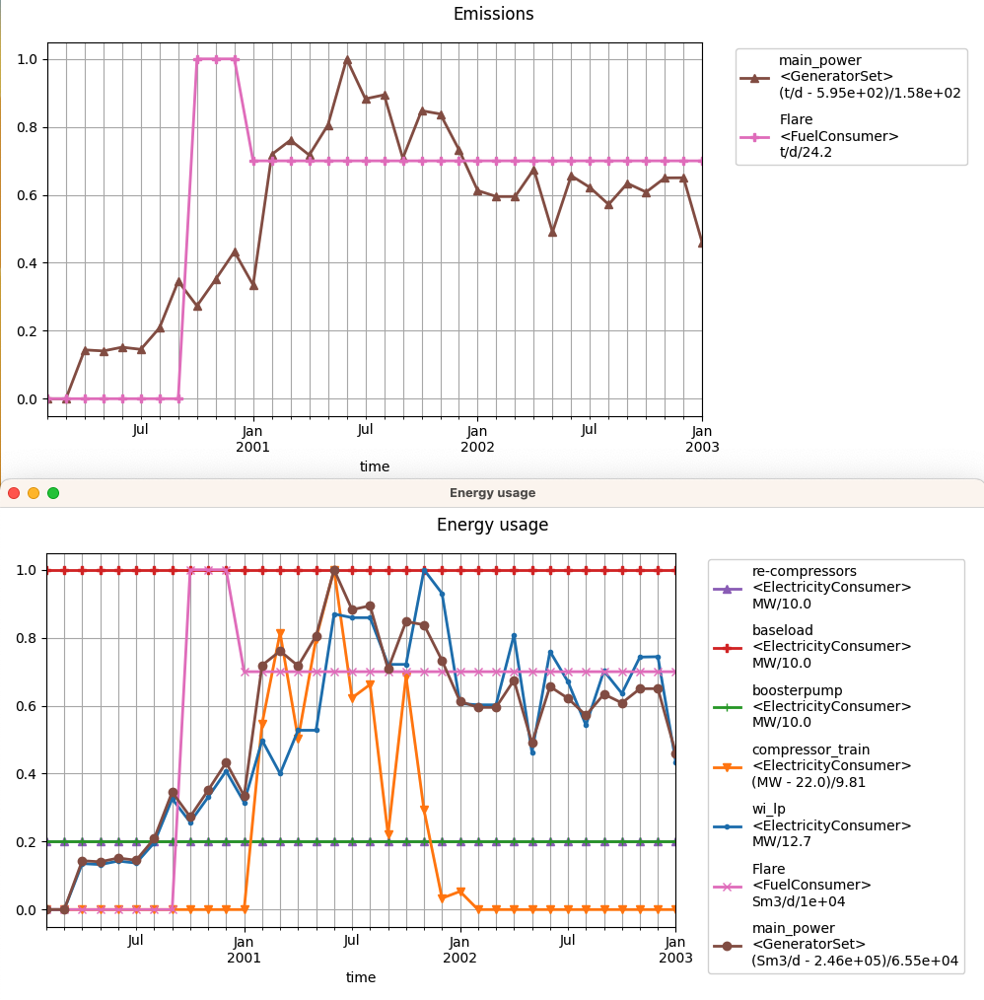

# Compute emissions for Reek/Drogon based on production time series

## What does `run-eCalc.py` do?

- Pre-process the simulator output (production data)
- Runs eCalc
- Extract emission results
- Write results
- Plot (optionally)

Except for the pre-processing,
these steps can all be found (in some shape or form)
among the example scripts distributed with eCalc.

## About

The difficult part is knowing how to do the configuration in

- `"some-model.yaml"`, which contains all-caps keywords
- the various constitutive relation files (`*.csv`).

The configuration herein is mainly sourced from the examples in the [eCalc docs](https://equinor.github.io/ecalc/docs/about/modelling/examples/).
But I cannot guarantee that the absolute numbers make sense,
or that all factors that impact emissions are logically configured, or even taken into account.

Fortunately, for our purposes, the absolute numbers are only of secondary importance.
What is important, before trying to optimise anything,
it to check that indeed the emissions exhibit sensitivity
to the control parameters that you wish to optimise for.
You should perform this check
by manipulating `df` in `run-eCalc.py:preprocess_prod()` or the raw `.csv` time series,
to reflect the relevant parameters, and then do `./run-eCalc.py plot`.

### Suggestions for further possibilities to consider

- Gas lift
- Different pump setup (no common manifold)

## Usage with ERT, PET, and other ensemble task managers

Prerequisites

- Install **eCalc** (in its own virtual env)
- Change `model_path` in `run-eCalc.py`.
  Examples: `reek-model.yaml`, `drogn.yaml`.
- Change `infile` in `run-eCalc.py` to the name
  you will give to the production time series data (csv from ECLIPSE/OPM).
  Examples: `from_geir.csv`, `drogon_mean.csv`
  (as in [eCalc docs/example](https://equinor.github.io/ecalc/docs/about/modelling/examples/drogon)).

ERT will need to

- Copy contents of this dir into the member dir
- Write the eCalc input variables from the ensemble member.
    - ECLIPSE/OPM output in `infile`.
    - Other relevant parameters in `model_path`.
- Run `run-eCalc.py`.
- Read output from `emissions.csv`.
